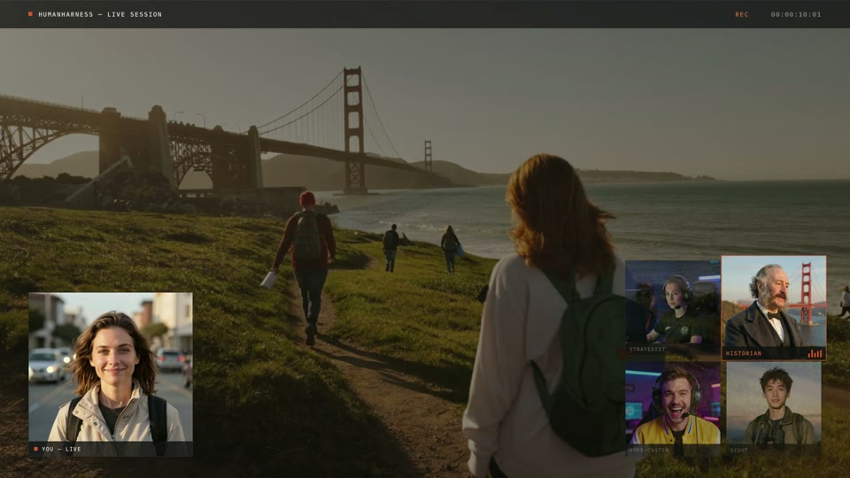

# HumanHarness

**One human. Many minds. Shared vision.**

> HumanHarness gives every person a live team of AI experts that watch what they see, discuss it together, and help them achieve their goals in real time.

<p align="center">
  <a href="https://youtu.be/5OYzcYGDgJc">
    
  </a>
  <br />
  <a href="https://youtu.be/5OYzcYGDgJc">▶ Watch the 1-minute video</a>
</p>

HumanHarness is a real-time human–AI collaboration platform: multiple AI agents watch the same live video feed as a human, discuss what they observe, and provide guidance, analysis, and ideas through distinct personalities and areas of expertise. The name is the point — like a team of horses pulling in harness, except here the human is guiding a team of specialized AI minds. The human is not being replaced but **amplified**: the human is the source of intent and agency; the AI collective provides leverage, not control.

Powered by [masky.ai](https://masky.ai) personalities and voices, every agent has a unique perspective, expertise, and communication style — so it feels less like asking a chatbot questions and more like collaborating with an expert team that's always looking over your shoulder. Agents debate strategies, surface relevant information, anticipate problems, and communicate naturally with each other and with you, optimized toward whatever goal you choose.

## Example use cases

- 🎮 **Gaming coach** — strategy agents debate optimal plays while spectators interact with them
- 🗺️ **City tour guide** — historians, food critics, architects, and locals comment as you walk
- 🔧 **Repair assistant** — engineering agents identify components and suggest next steps
- 📚 **Education** — professors from different disciplines explain what you're seeing
- 🧑‍🍳 **Cooking** — chefs monitor technique and timing while nutritionists suggest improvements
- 🚗 **Driving or navigation** — agents highlight hazards, landmarks, and route alternatives
- 🏭 **Industrial operations** — safety, maintenance, and process experts monitor live workflows
- ♿ **Accessibility** — agents describe surroundings and read signs for visually impaired users

Built for the **Memory Meets Motion** hackathon — AI that doesn't just react to your feed, it **remembers** it and **acts** on it:

| Layer | Sponsor | Role in HumanHarness |
|-------|---------|----------------------|
| Real-time data | **LaserData** | Ingests the labeled frame stream + human speech events so agents react to what's happening *now* |
| Memory | **FalkorDB** | Graph memory of everything the crew has seen — entities, places, plays, decisions, outcomes — so advice compounds across sessions |
| Motion / orchestration | **RocketRide.ai** | Turns memory into action: wires tool calls, external API lookups, and multi-step assists |
| Multi-agent collaboration | **Guild.ai** | Coordinates the specialist personas (Strategist, Historian, Hype-caster, Scout) and keeps the human in the loop |

## Architecture (MVP)

```
Twitch stream (video + audio)
        │
        ├── streamlink → ffmpeg ──► frame grab every 500 ms
        │                                │
        │                                ▼
        │                        vision labeler (frame → scene/object/event labels)
        │                                │
        └── audio ──► STT (human speech → text)
                                         │
                 ┌───────────────────────┤
                 ▼                       ▼
            LaserData  ◄── labeled frames + speech events (real-time signal stream)
                 │
                 ▼
            FalkorDB   ◄── entity/relationship graph, session + cross-session memory
                 │
                 ▼
          RocketRide.ai ── orchestrates decisions: lookups, tools, multi-step assists
                 │
                 ▼
             Guild.ai  ── routes work between personas, human-in-the-loop turns
                 │
                 ▼
        masky.ai personas (voice + character) ──► TTS commentary back to the human
```

The core loop:

1. **Ingest** — `streamlink` pulls the Twitch HLS feed; `ffmpeg` splits it into a 2 fps frame stream (one screenshot every 500 ms) and a 16 kHz mono audio stream.
2. **Perceive** — each frame is labeled by a vision model (scene, objects, on-screen events); the audio stream runs through STT so the human can just *talk* to the crew.
3. **Stream** — labeled frames and speech transcripts are published to **LaserData** as the live signal feed.
4. **Remember** — a consumer folds LaserData events into a **FalkorDB** graph: entities (bosses, streets, items, people) and relationships (defeated-by, located-in, mentioned-at), persisted across sessions.
5. **Act** — **RocketRide.ai** takes "what's happening + what we remember" and orchestrates actions: wiki lookups, map queries, strategy tools.
6. **Collaborate** — **Guild.ai** hands the result to the right persona (Strategist for tactics, Historian for lore/memory callbacks, Hype-caster for color, Scout for what's ahead) and manages agent↔agent and agent↔human turns.
7. **Speak** — the chosen persona renders its line through its **masky.ai** voice, back into the stream/overlay.

## Setup

The MVP is an **Electron app**: the main process runs the whole pipeline (ingest → perceive → signals → memory → crew) and the renderer is the live dashboard — feed preview, labels, transcript, crew commentary, and a goal box.

### Prerequisites

- Node.js 22+
- [ffmpeg](https://ffmpeg.org/) and [streamlink](https://streamlink.github.io/) on PATH (not needed in demo mode)
- Docker (for FalkorDB — optional; an in-memory graph is used as fallback)
- `ANTHROPIC_API_KEY` (vision labeling + persona crew)
- Optional API keys: LaserData, RocketRide.ai, Guild.ai, masky.ai, and an STT provider (Deepgram or OpenAI Whisper). Every sponsor integration has a local fallback so the loop runs without them.

### 1. Clone & install

```bash
git clone https://github.com/oceanseth/HumanHarness
cd HumanHarness
npm install
```

### 2. Start FalkorDB (optional)

Locally:

```bash
docker run -d --name humanharness-memory -p 6379:6379 falkordb/falkordb
```

Or point `FALKORDB_URL` at a managed FalkorDB Cloud instance. Use the scheme the
instance actually serves — `rediss://` only if it terminates TLS on that port,
`redis://` otherwise. A `rediss://` URL against a plaintext port looks exactly
like an unreachable instance: the connection times out and memory silently falls
back.

Either way, if it's not reachable, memory falls back to an in-process graph
automatically and startup is never blocked.

### 3. Configure

Copy `.env.example` to `.env` and fill in what you have. The two that matter most:

```ini
TWITCH_CHANNEL=your_channel_name
ANTHROPIC_API_KEY=sk-ant-...
```

Set `MOCK_INGEST=true` to demo the full crew loop with scripted scene labels — no stream, no streamlink/ffmpeg.

The sponsor services each need one more line, and each has a fallback if you skip it:

```ini
LASER_CONNECTION_STRING=<token>@<deployment>.laserdata.cloud   # or LASERDATA_DOMAIN + user/password
FALKORDB_URL=redis://localhost:6379                            # or a managed instance
ROCKETRIDE_API_KEY=rr_...                                      # Scout lookups; also uses ANTHROPIC_API_KEY
MASKY_API_KEY=mky_...                                          # plus MASKY_AVATAR_ID and MASKY_AVATAR_OWNER_USER_ID
```

### 4. Run

```bash
npm start
```

Hit **Start** in the window. The main process spawns streamlink/ffmpeg (frame grabs every 500 ms → Claude vision labeler → LaserData signal stream; audio → STT), folds labels into the FalkorDB graph, and every few seconds the Guild-routed crew picks a persona to speak — voiced through masky.ai when a key is present, browser speechSynthesis otherwise. Type in the "talk to the crew" box (or speak, with STT configured) and set a goal — the personas optimize their commentary and lookups around it.

## Repo layout

```
main.js           # Electron main process — window + pipeline wiring over IPC
preload.js        # contextBridge API for the renderer
renderer/         # dashboard UI: feed, labels, transcript, commentary, goal
src/
  config.js       # .env loading + defaults
  pipeline.js     # the core loop, wires everything below together
  ingest.js       # streamlink + ffmpeg: 500ms frame grabs + audio segments (+ mock mode)
  perceive.js     # frame labeler (Claude vision → structured labels)
  stt.js          # Deepgram / Whisper transcription
  signals.js      # LaserData publisher (local event bus fallback)
  memory.js       # FalkorDB graph writer/reader (in-memory fallback)
  actions.js      # RocketRide.ai orchestration (mock fallback)
  crew.js         # Guild routing + persona prompts + masky.ai voices
.env.example
```

## Personas (masky.ai)

| Persona | Job |
|---------|-----|
| **Strategist** | Tactics toward the stated goal — "you have a 500 ms window after his slam, dodge left" |
| **Historian** | Memory callbacks from FalkorDB — "last session this same miniboss wiped you when you greeded the third hit" |
| **Hype-caster** | Color commentary, energy, celebration |
| **Scout** | What's ahead — pulls lookups via RocketRide (maps, wikis, schedules) before you get there |

## Open Session

This repo is built under the [Open Session License](./OPEN-SESSION-LICENSE.md): every human and model turn that shapes it is appended verbatim to [`llm-turn-history.jsonl`](./llm-turn-history.jsonl) — append-only, never loaded as machine context. Watch the sessions live at [opensession.groupnetwork.com](https://opensession.groupnetwork.com). Code is MIT (see [`LICENSE`](./LICENSE)); the session-transparency conditions ride along.

## Hackathon notes

All four sponsor technologies are load-bearing: LaserData is the only path signals enter the system, FalkorDB is the only store agents read memory from, RocketRide.ai executes every external action, and Guild.ai owns all agent routing. Pull any one out and the loop breaks.
